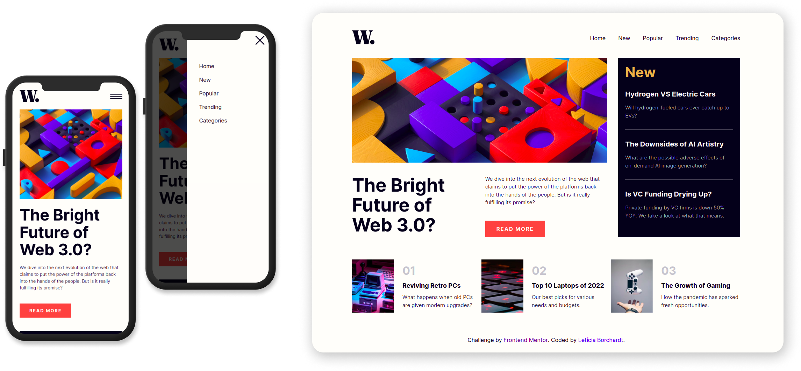

# Frontend Mentor - News homepage solution

This is a solution to the [News homepage challenge on Frontend Mentor](https://www.frontendmentor.io/challenges/news-homepage-H6SWTa1MFl). Frontend Mentor challenges help you improve your coding skills by building realistic projects. 

## Table of contents

- [Overview](#overview)
  - [The challenge](#the-challenge)
  - [Screenshot](#screenshot)
- [My process](#my-process)
  - [Built with](#built-with)
  - [Useful resources](#useful-resources)
- [Author](#author)

## Overview

Hello! I really like frontend and I'm always practicing new styles. 
This time I discovered the Frontend Mentor, and it have so many cool things to work on!

I choose this challenge because its very interesting and beatiful, and I wanted to improve some skils :muscle:

### The challenge

Users should be able to:

- View the optimal layout for the interface depending on their device's screen size
- See hover and focus states for all interactive elements on the page

### Screenshot

This was the result of my solution for the challenge :blush:

## My process

I recently started studying Sass and Gulp and started this challenge to improve my knowledge. 

I also wanted to work more with GRID and responsive designs, so the challenge was well spent and fun to do. 
I tried to apply the "BEM" pattern for naming style classes and I think I got a good result since it was my first time.

Obviously I have a lot to work on, but I felt satisfied with the results of this screens :)

### Built with

- HTML5
- SASS
- Flexbox and Grid
- Javascript
- Gulp js

### Useful resources

- [BEM](https://getbem.com/introduction/) - This helped me to organize my css classes. I really liked this pattern and will use it going forward.
- [Gulp js](https://gulpjs.com/) - This helped me to compile files and improve my development, it's a very good tool.

## Author

- Frontend Mentor - [@leticiaborchardt](https://www.frontendmentor.io/profile/leticiaborchardt)